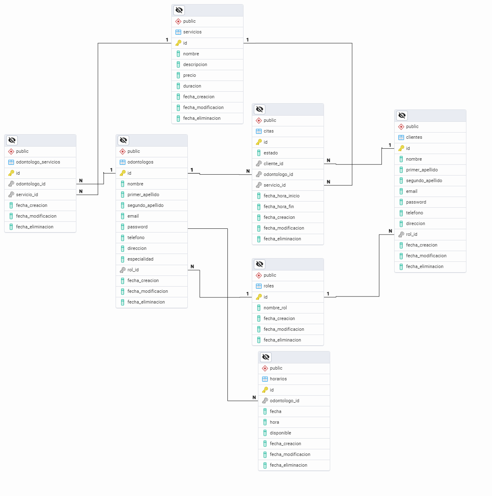

# 🦷 Proyecto Clínica Dental

Este proyecto corresponde a una **clínica dental** desarrollada para gestionar de manera eficiente la administración de odontólogos, clientes, servicios, citas y más. La aplicación está diseñada para facilitar la organización y automatización de los procesos clínicos, mejorando la experiencia tanto para los profesionales como para los clientes.

---

## 🚀 **Funcionalidades principales**

- **Gestión de odontólogos**: Registro, edición y eliminación de odontólogos, incluyendo sus especialidades y servicios ofrecidos.
- **Gestión de clientes**: Administración de los datos de los pacientes, con historial de citas y tratamientos.
- **Agendamiento de citas**: Sistema automatizado de horarios y citas entre clientes y odontólogos.
- **Control de servicios**: Registro de los servicios ofrecidos por la clínica dental, asignación a odontólogos y tarifas.
- **Gestión de roles**: Administración de usuarios del sistema con niveles de acceso para odontólogos y clientes.

---

## 📋 **Entidades del Sistema**

### 1️⃣ **Odontólogos**

Esta entidad almacena la información relacionada con los profesionales que trabajan en la clínica dental.

**Campos:**

- `id`: Identificador único.
- `nombre`: Nombre del odontólogo.
- `primer_apellido`: Primer apellido del odontólogo.
- `segundo_apellido`: Segundo apellido del odontólogo.
- `email`: Correo electrónico del odontólogo.
- `telefono`: Número de contacto.
- `direccion`: Dirección física o clínica.
- `especialidad`: Especialización dental (ej. Ortodoncia, Periodoncia).
- `rol_id`: Identificador del rol asignado al odontólogo.
- **Fechas de control**:
    - `fecha_creacion`
    - `fecha_modificacion`
    - `fecha_eliminacion`

---

### 2️⃣ **Clientes**

Esta entidad gestiona la información de los pacientes que asisten a la clínica dental.

**Campos:**

- `id`: Identificador único.
- `nombre`: Nombre del cliente.
- `primer_apellido`: Primer apellido del cliente.
- `segundo_apellido`: Segundo apellido del cliente.
- `email`: Correo electrónico.
- `password`: Contraseña del cliente.
- `telefono`: Número de contacto.
- `direccion`: Dirección del paciente.
- `rol_id`: Identificador del rol asignado al cliente.
- **Fechas de control**:
    - `fecha_creacion`
    - `fecha_modificacion`
    - `fecha_eliminacion`

---

### 3️⃣ **Servicios**

Registro de los diferentes tratamientos y servicios que se ofrecen en la clínica.

**Campos:**

- `id`: Identificador único.
- `nombre`: Nombre del servicio (ej. Limpieza dental, Implante).
- `descripcion`: Detalles del servicio.
- `precio`: Costo del servicio.
- `duracion`: Duración del servicio en minutos.
- **Fechas de control**:
    - `fecha_creacion`
    - `fecha_modificacion`
    - `fecha_eliminacion`

---

### 4️⃣ **Roles**

Entidades para gestionar los roles de los usuarios en el sistema.

**Campos:**

- `id`: Identificador único.
- `nombre_rol`: Nombre del rol (ej. Odontólogo, Cliente).
- **Fechas de control**:
    - `fecha_creacion`
    - `fecha_modificacion`
    - `fecha_eliminacion`

---

### 5️⃣ **Odontólogos_Servicios**

Tabla intermedia para relacionar los odontólogos con los servicios que ofrecen.

**Campos:**

- `odontologo_id`: Identificador del odontólogo.
- `servicio_id`: Identificador del servicio.
- **Fechas de control**:
    - `fecha_creacion`
    - `fecha_modificacion`
    - `fecha_eliminacion`

---

### 6️⃣ **Horarios**

Gestiona los horarios disponibles para la programación de citas de los odontólogos.

**Campos:**

- `id`: Identificador único.
- `odontologo_id`: Identificador del odontólogo.
- `fecha`: Fecha del horario disponible.
- `hora`: Hora específica de disponibilidad.
- `disponible`: Indica si el horario está disponible (`true`/`false`).
- **Fechas de control**:
    - `fecha_creacion`
    - `fecha_modificacion`
    - `fecha_eliminacion`

---

### 7️⃣ **Citas**

Registro de las citas que se programan entre los clientes y los odontólogos.

**Campos:**

- `id`: Identificador único.
- `estado`: Estado de la cita (ej. _Programada, Cancelada, Completada_).
- `cliente_id`: Identificador del cliente.
- `odontologo_id`: Identificador del odontólogo.
- `fecha_hora_inicio`: Fecha y hora de inicio de la cita.
- `fecha_hora_fin`: Fecha y hora de finalización de la cita.
- **Fechas de control**:
    - `fecha_creacion`
    - `fecha_modificacion`
    - `fecha_eliminacion`

## **💻Tecnologías utilizadas**

- **PostgreSQL**: Sistema de gestión de base de datos relacional que almacena y organiza la información de la clínica.
- **pgAdmin**: Herramienta gráfica para administrar y visualizar la base de datos PostgreSQL.
- **Node.js**: Entorno de ejecución de JavaScript utilizado como base para el backend.
- **Backend**: Desarrollado con **NestJS**, un framework moderno y escalable basado en Node.js que utiliza TypeScript para la lógica del servidor.
- **Frontend**: Construido con **Vue.js**, un framework progresivo para crear interfaces de usuario dinámicas e interactivas.
- **TypeORM**: ORM (Object-Relational Mapping) utilizado para la interacción con la base de datos.
- **Postman**: Herramienta para probar y documentar las APIs del backend
- **Swagger**: Herramienta de documentación de APIs utilizada para generar automáticamente una interfaz interactiva para probar y explorar los endpoints del backend.

## 📊 **Diagrama de Entidades y Relaciones (ERD)**

A continuación, se presenta el diagrama de entidades y relaciones (ERD) que muestra la estructura actualizada de la base de datos utilizada en este sistema:

