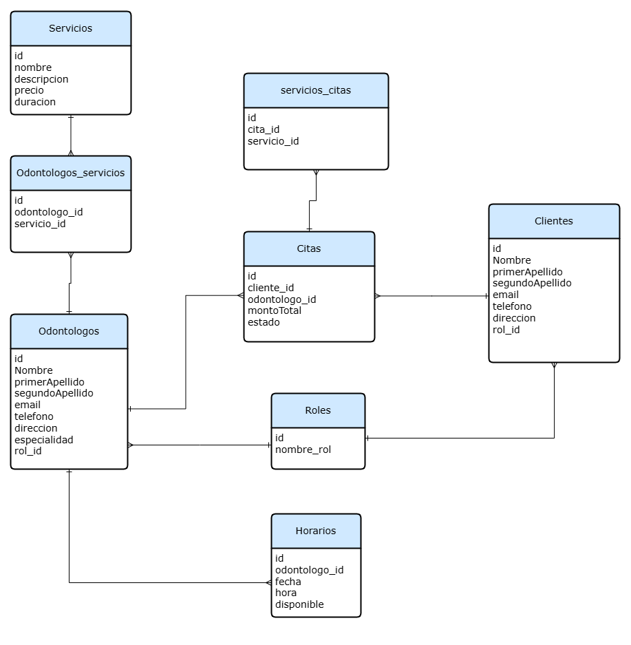

# Proyecto Clínica Dental

Este proyecto corresponde a una **clínica dental** desarrollada para gestionar de manera eficiente la administración de odontólogos, clientes, servicios, citas y más. La aplicación está diseñada para facilitar la organización y automatización de los procesos clínicos, mejorando la experiencia tanto para los profesionales como para los pacientes.

## Funcionalidades principales

- **Gestión de odontólogos**: Registro, edición y eliminación de odontólogos, incluyendo sus especialidades y servicios ofrecidos.
- **Gestión de clientes**: Administración de los datos de los pacientes, con historial de citas y tratamientos.
- **Agendamiento de citas**: Sistema automatizado de horarios y citas entre clientes y odontólogos.
- **Control de servicios**: Registro de los servicios ofrecidos por la clínica dental, asignación a odontólogos y tarifas.
- **Gestión de roles**: Administración de usuarios del sistema con distintos niveles de acceso (administradores, odontólogos, recepcionistas, etc.).

## Entidades del Sistema

### 1. **Odontólogos**
Esta entidad almacena la información relacionada con los profesionales que trabajan en la clínica dental.

**Campos:**
- `id`: Identificador único.
- `nombre`: Nombre del odontólogo.
- `primerApellido`: Primer apellido del odontólogo.
- `segundoApellido`: Segundo apellido del odontólogo.
- `email`: Correo electrónico del odontólogo.
- `teléfono`: Número de contacto.
- `dirección`: Dirección física o clínica.
- `especialidad`: Especialización dental (ej. Ortodoncia, Periodoncia).
- `rol_id`: Rol del odontólogo (Odontólogo, Cliente).

### 2. **Clientes**
Esta entidad gestiona la información de los pacientes que asisten a la clínica dental.

**Campos:**
- `id`: Identificador único.
- `nombre`: Nombre del cliente.
- `primerApellido`: Primer apellido del cliente
- `segundoApellido`: Segundo Apellido del cliente.
- `email`: Correo electrónico.
- `password`: Contraseña del cliente.
- `teléfono`: Número de contacto.
- `dirección`: Dirección del paciente.
- `rol_id`: Rol del Cliente (Odontólogo, Cliente).

### 3. **Servicios**
Registro de los diferentes tratamientos y servicios que se ofrecen en la clínica.

**Campos:**
- `id`: Identificador único.
- `nombre_servicio`: Nombre del servicio (ej. Limpieza dental, Implante).
- `descripción`: Detalles del servicio.
- `precio`: Costo del servicio.
- `duración`: Duración del servicio en minutos.

### 4. **Roles**
Entidades para gestionar los roles de los usuarios en el sistema.

**Campos:**
- `id`: Identificador único.
- `nombre_rol`: Nombre del rol (Odontólogo, Cliente).

### 5. **Odontólogos_Servicios**
Tabla intermedia para relacionar los odontólogos con los servicios que ofrecen.

**Campos:**
- `id`: Identificador único.
- `odontologo_id`: Identificador del odontólogo.
- `servicio_id`: Identificador del servicio.

### 6. **Horarios**
Gestiona los horarios disponibles para la programación de citas de los odontólogos.

**Campos:**
- `id`: Identificador único.
- `odontologo_id`: Identificador del odontólogo.
- `fecha`: Fecha del horario.
- `hora`: Hora del horario .
- `disponible`: Disponibilidad.

### 7. **Citas**
Registro de las citas que se programan entre los clientes y los odontólogos.

**Campos:**
- `id`: Identificador único.
- `cliente_id`: Identificador del cliente.
- `odontologos_id`: Identificador del odontologo.
- `montoTotal`: Monto total de la cita.
- `estado`: Estado de la cita (Programada, Cancelada, Completada).

### 8. **Servicio_citas**
Registro de los servicios asociados a las citas programadas entre los clientes y los odontólogos.

**Campos:**
- `id`: Identificador único.
- `cita_id`: Identificador de la cita.
- `servicio_id`: Identificador del servicio.

  
## Diagrama de Entidades y Relaciones de la Clínica Dental

A continuación, se presenta el diagrama de entidades y relaciones (ERD) que muestra la estructura de la base de datos utilizada en este sistema.

